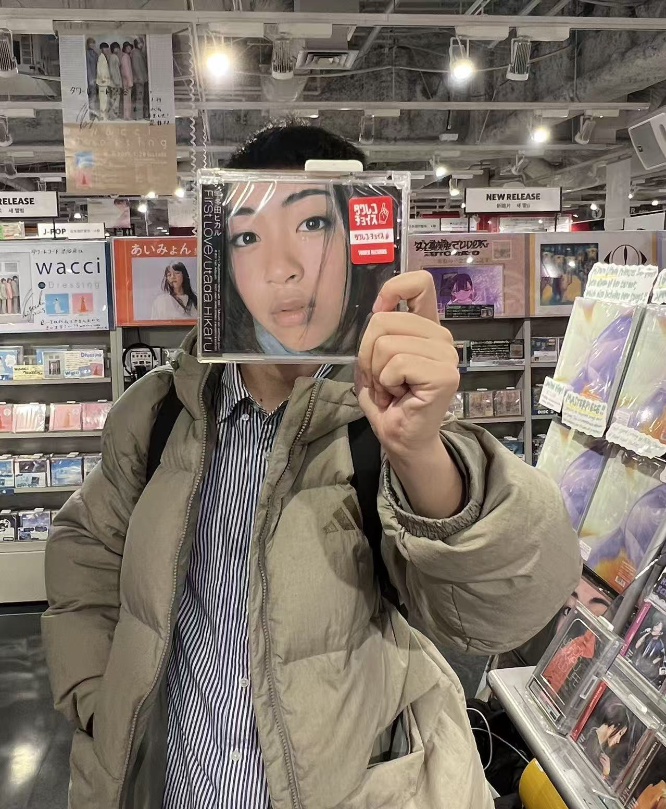

## About Me

Hi! &#128075; I am Yihang Du(杜艺航), an undergraduate student at [Zhongnan University of Economics and Law](https://english.zuel.edu.cn/), majoring in statistics. I am currently a research assistant at [FreedomAI Lab@CUHK-Shenzhen](https://freedomintelligence.github.io/), supervised by [Prof. Benyou Wang](https://wabyking.github.io/old.html) and [Dr. Yan Hu](https://scholar.google.com/citations?user=-zzJSRQAAAAJ&hl=en). 

I also worked with [Prof. Xiaobo Sun](https://med.emory.edu/directory/profile/?u=XSUN28) from Emory University, and it was a truly life-changing period where I had the privilege to collaborate with talented researchers and learn immensely from them.

## Research Interests
Generally, I am interested in advancing the capabilities and efficiency of Multimodal Language Models (MLLMs) to enable more human-like perception and reasoning.

- **Efficient Perception through Vision-Language Alignment** (Grounding, Multilingual, Representation)
- **Reasoning via Efficient Multimodal Fusion** (Think with Image, Latent Reasoning)

I also have experience in bioinformatics, particularly in omics data, where gene sequences can be viewed as structured language representations.

<!--  -->
## Education
- [Zhongnan University of Economics and Law](https://english.zuel.edu.cn/) 2022.09 - 2026.06(*exp.*)  
  *B.Sc.* in Statistics

## Experience
- **CUHK-Shenzhen**   2025.08 - Present  
  *Research Assistant* at [FreedomAI Lab](https://freedomintelligence.github.io/), supervisor: [Prof. Benyou Wang](https://wabyking.github.io/old.html) and [Dr. Yan Hu](https://scholar.google.com/citations?user=-zzJSRQAAAAJ&hl=en)

- **Emory University** 2025.02 - 2025.08  
  *Research Assistant*, supervisor: [Prof. Xiaobo Sun](https://med.emory.edu/directory/profile/?u=XSUN28)

## News
- **[2026.01]** A paper is accepted by *Bioinformatics*.
- **[2025.09]** I'm excited to join the FreedomAI Lab as an RA for the rest of my undergrad. Enjoy Shenzhen life!
- **[2025.09]** Our [paper](https://arxiv.org/abs/2509.16629) is accepted by NeurIPS 2025.
- **[2025.04]** Our [paper](https://arxiv.org/abs/2505.14128) is accepted by IJCAI 2025. See you in Guangzhou!



## Misc

- I am a big fan of Podcasts and I like playing table tennis.
- I enjoy taking photographs &#128247; in my free time. I use a SONY A7M4 and I am passionate about capturing the beauty during my travels.

<!-- ## Blog

  <a href="/blog.html" style="display: inline-block; padding: 12px 24px; background: #f5f5f5; border-radius: 6px; text-decoration: none; color: #333; font-weight: 500; transition: all 0.2s ease;"> Read My Blog</a>

 -->

<figure style="display: block; text-align: center;">
  
  <figcaption style="font-size: 12px; color: gray; margin-top: 8px;">
   At Tower Records | Shibuya, Tokyo 2025.
  </figcaption>
</figure>

---
 
 

<!-- ## Gallery

Check out my <a href="/gallery.html">gallery</a> here! -->

